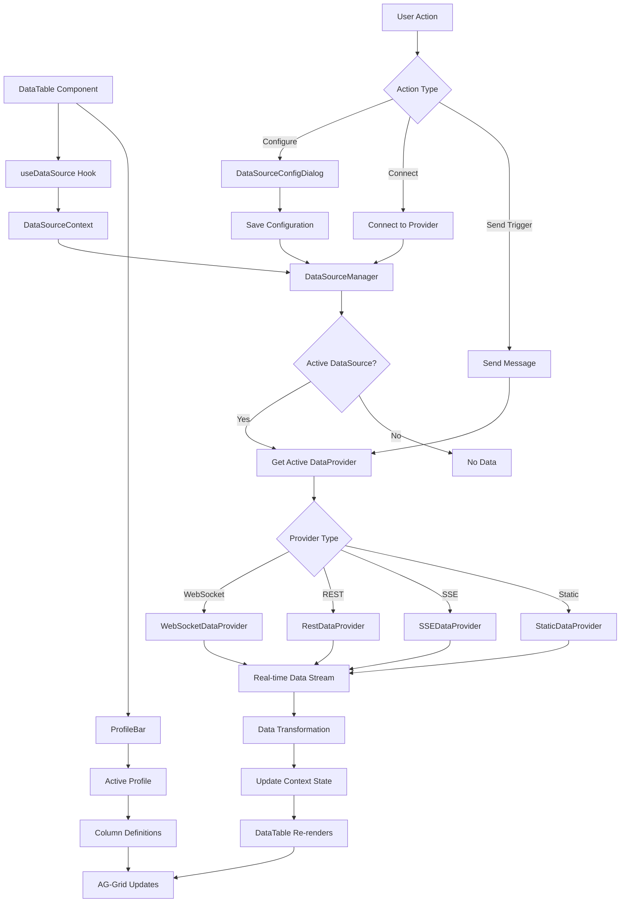

# DataTable to DataProvider Flow Diagram

## Overview

This document illustrates how the DataTable component accesses and uses DataProviders in the app-v2 architecture.

## Flow Diagram



## Component Relationships

### 1. DataTable Component
```typescript
function DataTable({ id }: DataTableProps) {
  // Access data through hook
  const { data, activeDataSourceId, dataSources } = useDataSource();
  
  // Get active data source configuration
  const activeDataSource = dataSources.find(ds => ds.id === activeDataSourceId);
  
  // Use column definitions from data source
  const columnDefs = activeDataSource?.columnDefs || defaultColumns;
  
  return (
    <AgGridReact
      rowData={data}
      columnDefs={columnDefs}
      // ... other props
    />
  );
}
```

### 2. DataSource Context & Hook
```typescript
// Context provides centralized data management
const DataSourceContext = createContext<DataSourceContextValue>({
  dataSources: [],
  activeDataSourceId: null,
  data: [],
  connectionStatus: new Map(),
  // ... methods
});

// Hook for easy access
export function useDataSource() {
  return useContext(DataSourceContext);
}
```

### 3. DataProvider Architecture
```typescript
// Base interface all providers implement
interface DataProvider {
  connect(): Promise<void>;
  disconnect(): Promise<void>;
  send(trigger: DataProviderTrigger): Promise<void>;
  on(event: string, handler: Function): void;
  off(event: string, handler: Function): void;
}

// Example: WebSocket implementation
class WebSocketDataProvider implements DataProvider {
  async connect() {
    this.ws = new WebSocket(this.config.url);
    this.ws.onmessage = (event) => {
      const data = JSON.parse(event.data);
      this.emit('data', data);
    };
  }
  
  async send(trigger: DataProviderTrigger) {
    // Supports both string and JSON
    const message = typeof trigger === 'string' 
      ? trigger 
      : JSON.stringify(trigger);
    this.ws.send(message);
  }
}
```

## Data Flow Steps

### 1. Initial Setup
1. User configures data source via `DataSourceConfigDialog`
2. Configuration includes provider type, URL, auth, field mappings
3. Field inference analyzes data structure
4. Column definitions are created from selected fields
5. Configuration saved to profile system

### 2. Connection Flow
1. User selects data source from `DataSourceSelector`
2. DataSourceManager creates appropriate provider instance
3. Provider connects to data source
4. Connection status updates in UI

### 3. Data Reception
1. Provider receives data (WebSocket message, REST response, etc.)
2. Data passes through configured transformations
3. DataSourceManager updates context state
4. DataTable re-renders with new data
5. AG-Grid displays updated rows

### 4. User Interactions
1. **Send Trigger**: User sends message through provider
2. **Column Changes**: Saved to active profile (manual save only)
3. **Filter/Sort**: Applied locally by AG-Grid
4. **Switch DataSource**: Changes active provider and data stream

## Integration Points

### With Profile System
- Column definitions stored in data source config
- Grid state (column widths, positions) stored in profile
- Profile changes don't affect data source connection

### With AG-Grid
- DataTable passes `rowData` from context
- Column definitions from data source config
- Grid state from active profile
- Manual save prevents infinite loops

### With UI Components
- `DataSourceButton`: Opens configuration dialog
- `DataSourceSelector`: Switches between sources
- `ConnectionStatus`: Shows real-time status
- `ProfileBar`: Manages grid layout profiles

## Example Usage Flow

1. **Configure WebSocket Data Source**
   ```
   URL: ws://localhost:8080/data
   Trigger: {"action": "subscribe", "channel": "trades"}
   ```

2. **Infer Fields**
   - Click "Infer Fields from Data"
   - System connects temporarily to analyze structure
   - Shows hierarchical field tree

3. **Select Fields**
   - Check desired fields
   - Configure column properties
   - Save configuration

4. **Connect & Display**
   - DataTable uses configuration
   - Real-time data flows to grid
   - User can resize/reorder columns
   - Save layout with profile save button

## Key Benefits

1. **Separation of Concerns**
   - DataProviders handle connection logic
   - DataSourceContext manages state
   - DataTable focuses on display
   - Profiles manage layout

2. **Flexibility**
   - Multiple provider types
   - Custom transformations
   - Field mapping
   - Profile-based layouts

3. **Performance**
   - Centralized data management
   - Efficient re-renders
   - Debounced updates
   - No infinite loops

## Troubleshooting

### Data Not Showing
1. Check connection status in UI
2. Verify data source configuration
3. Check browser console for errors
4. Ensure column definitions match data

### Connection Issues
1. Verify URL is accessible
2. Check authentication settings
3. Test with Static provider first
4. Check CORS for REST endpoints

### Performance Issues
1. Limit data volume in transformations
2. Use AG-Grid row virtualization
3. Debounce rapid updates
4. Profile re-renders with React DevTools