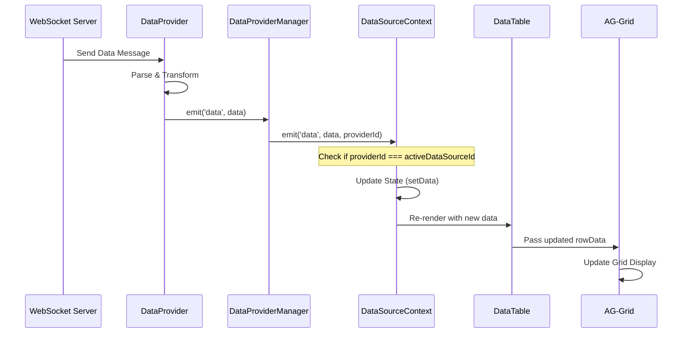

# Real-Time Update Flow for DataTable

## Overview

This document explains how real-time updates from DataProviders flow to the DataTable component and update the AG-Grid display.

## Real-Time Update Flow



## Key Components

### 1. DataProvider Event Emission
```typescript
// WebSocketDataProvider example
class WebSocketDataProvider extends BaseDataProvider {
  private handleMessage = (event: MessageEvent) => {
    try {
      const data = JSON.parse(event.data);
      
      // Apply input transformation if configured
      const transformed = this.applyInputTransform(data);
      
      // Emit data event
      this.emit('data', transformed);
    } catch (error) {
      this.emit('error', error);
    }
  };
}
```

### 2. DataSourceContext State Management
```typescript
// In DataSourceContext.tsx (lines 86-94)
managerRef.current.on('data', (receivedData: any, providerId: string) => {
  if (providerId === activeDataSourceId) {
    if (Array.isArray(receivedData)) {
      setData(prev => [...prev, ...receivedData]);
    } else {
      setData(prev => [...prev, receivedData]);
    }
  }
});
```

### 3. DataTable Component Integration
```typescript
function DataTable({ id }: DataTableProps) {
  // Get real-time data from context
  const { data, activeDataSourceId, dataSources } = useDataSource();
  
  // Find active data source configuration
  const activeDataSource = dataSources.find(ds => ds.id === activeDataSourceId);
  
  // Use column definitions from data source
  const columnDefs = activeDataSource?.columnDefs || defaultColumns;
  
  return (
    <AgGridReact
      rowData={data}  // This updates automatically
      columnDefs={columnDefs}
      animateRows={true}  // Smooth updates
      getRowId={(params) => params.data.id}  // Track rows
    />
  );
}
```

## Update Strategies

### 1. Append Mode (Current Implementation)
```typescript
// Adds new data to existing array
setData(prev => [...prev, receivedData]);
```
- **Use Case**: Trade data, logs, events
- **Pros**: Simple, preserves history
- **Cons**: Memory growth over time

### 2. Replace Mode
```typescript
// Replace entire dataset
setData(receivedData);
```
- **Use Case**: Snapshots, full refreshes
- **Pros**: Memory efficient
- **Cons**: Loses local state

### 3. Update/Merge Mode
```typescript
// Update existing rows, add new ones
setData(prev => {
  const dataMap = new Map(prev.map(item => [item.id, item]));
  receivedData.forEach(item => dataMap.set(item.id, item));
  return Array.from(dataMap.values());
});
```
- **Use Case**: Live pricing, status updates
- **Pros**: Efficient updates
- **Cons**: Requires unique IDs

### 4. Window Mode
```typescript
// Keep only last N records
const MAX_RECORDS = 1000;
setData(prev => [...prev, receivedData].slice(-MAX_RECORDS));
```
- **Use Case**: High-frequency data
- **Pros**: Memory bounded
- **Cons**: Loses old data

## Configuration Options

### Data Source Configuration
```typescript
interface DataSourceConfig {
  // Update strategy
  updateMode: 'append' | 'replace' | 'merge' | 'window';
  
  // Window size for window mode
  windowSize?: number;
  
  // Unique ID field for merge mode
  idField?: string;
  
  // Throttle updates (ms)
  updateThrottle?: number;
  
  // Batch updates
  batchUpdates?: boolean;
  batchSize?: number;
  batchTimeout?: number;
}
```

### Enhanced Implementation
```typescript
// DataSourceContext with update strategies
const handleData = useCallback((receivedData: any, providerId: string) => {
  if (providerId !== activeDataSourceId) return;
  
  const dataSource = dataSources.find(ds => ds.id === providerId);
  const mode = dataSource?.updateMode || 'append';
  
  switch (mode) {
    case 'append':
      setData(prev => [...prev, ...toArray(receivedData)]);
      break;
      
    case 'replace':
      setData(toArray(receivedData));
      break;
      
    case 'merge':
      const idField = dataSource?.idField || 'id';
      setData(prev => mergeData(prev, receivedData, idField));
      break;
      
    case 'window':
      const size = dataSource?.windowSize || 1000;
      setData(prev => 
        [...prev, ...toArray(receivedData)].slice(-size)
      );
      break;
  }
}, [activeDataSourceId, dataSources]);
```

## Performance Optimizations

### 1. Throttling Updates
```typescript
// Use throttled update function
const throttledSetData = useThrottle((newData) => {
  setData(newData);
}, 100); // Update at most every 100ms
```

### 2. Batch Processing
```typescript
const batchBuffer = useRef<any[]>([]);
const batchTimeout = useRef<NodeJS.Timeout>();

const handleBatchedData = (data: any) => {
  batchBuffer.current.push(data);
  
  clearTimeout(batchTimeout.current);
  batchTimeout.current = setTimeout(() => {
    setData(prev => [...prev, ...batchBuffer.current]);
    batchBuffer.current = [];
  }, 50); // Batch for 50ms
};
```

### 3. AG-Grid Optimizations
```typescript
<AgGridReact
  // Efficient row tracking
  getRowId={(params) => params.data.id}
  
  // Async updates
  asyncTransactionWaitMillis={500}
  
  // Row buffer for smooth scrolling
  rowBuffer={10}
  
  // Debounce scroll events
  debounceVerticalScrollbar={true}
  
  // Immutable data mode
  immutableData={true}
  
  // Delta updates
  deltaRowDataMode={true}
/>
```

## Example: Live Trading Data

```typescript
// WebSocket message format
{
  "type": "trade",
  "data": {
    "id": "12345",
    "symbol": "AAPL",
    "price": 150.25,
    "volume": 1000,
    "timestamp": 1702345678900
  }
}

// Data source configuration
{
  "id": "live-trades",
  "type": "websocket",
  "updateMode": "window",
  "windowSize": 500,
  "columnDefs": [
    { "field": "symbol", "headerName": "Symbol" },
    { "field": "price", "headerName": "Price", "valueFormatter": currencyFormatter },
    { "field": "volume", "headerName": "Volume" },
    { "field": "timestamp", "headerName": "Time", "valueFormatter": timeFormatter }
  ]
}

// Result: Grid shows latest 500 trades with smooth updates
```

## Troubleshooting

### Updates Not Appearing
1. Check `activeDataSourceId` matches provider ID
2. Verify data event is being emitted
3. Check console for transform errors
4. Ensure column definitions match data structure

### Performance Issues
1. Enable update throttling
2. Use window mode for high-frequency data
3. Implement virtual scrolling
4. Use immutable data mode in AG-Grid

### Memory Leaks
1. Implement window mode or periodic cleanup
2. Remove event listeners on unmount
3. Clear data when switching sources
4. Monitor array size in DevTools